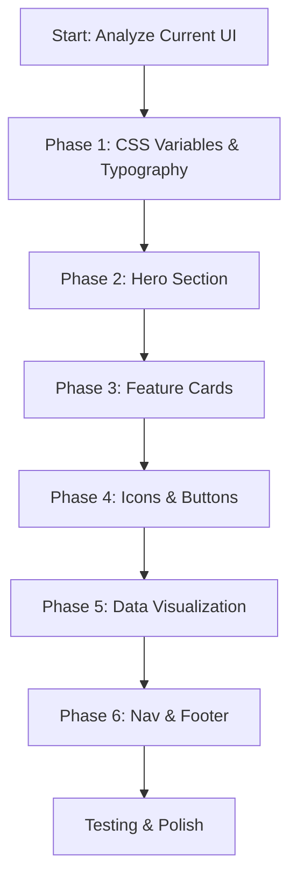

# Agritech Civilizational Mission - UI Transformation Plan

## Executive Summary
Transform the existing AgriTech landing page to a premium dark-themed aesthetic that balances industrial technology with organic growth, embodying "Rooted in the Soil, Reaching for the Sky."

---

## Current State Analysis

### Existing Theme
- **Background:** `#030712` (Dark blue-black)
- **Accent:** Green (`#22c55e` dark mode, `#16a34a` light mode)
- **Typography:** Open Sans (body), Libertinus Serif (headlines)
- **Layout:** Responsive grid, basic card styling

### Target Theme
- **Background:** Deep Forest Green `#051a05`
- **Primary Accent:** Goldenrod `#ffcc00` (CTAs, headings)
- **Secondary:** Emerald Green, Soft Mint (interactive elements)
- **Typography:** Playfair Display (headlines), Inter/Montserrat (body)
- **Visual:** Glassmorphism cards, data overlay, gold icons

---

## Implementation Tasks

### Phase 1: Core CSS Variables & Typography
- [ ] Update `:root` CSS variables in `index.html` and `index.css`
  - Background: `#051a05`
  - Surface: `rgba(10, 40, 10, 0.85)`
  - Primary Accent: `#ffcc00` (Goldenrod)
  - Secondary Accent: `#10b981` (Emerald)
  - Tertiary: `#6ee7b7` (Mint)
  - Text: `#f5f5dc` (Pale Cream/Beige)
  - Border: `rgba(255, 204, 0, 0.2)`
- [ ] Add Google Fonts: Playfair Display, Inter
- [ ] Update body font-family to Inter
- [ ] Update `.serif` class to Playfair Display

### Phase 2: Hero Section Redesign
- [ ] Add CSS grid overlay effect for data visualization
- [ ] Implement floating nodes animation
- [ ] Update hero gradient background
- [ ] Add subtle particle effect background
- [ ] Style hero text with golden accent

### Phase 3: Feature Cards (Glassmorphism)
- [ ] Convert to 3-column grid
- [ ] Add glassmorphism effect: `backdrop-filter: blur(12px)`
- [ ] Add semi-transparent green background
- [ ] Implement gold border glow on hover
- [ ] Add scale transform on hover

### Phase 4: Iconography & Buttons
- [ ] Replace emoji icons with Font Awesome gold icons
- [ ] Style primary buttons: solid `#ffcc00` with black text
- [ ] Add hover glow effect
- [ ] Style secondary buttons with gold border

### Phase 5: Data Visualization Section
- [ ] Create "The Numbers That Matter" section
- [ ] Add large-scale typography for statistics
- [ ] Add elegant gold icons for metrics
- [ ] Style with gradient backgrounds

### Phase 6: Navigation & Footer
- [ ] Update navbar background with glassmorphism
- [ ] Style navigation links with gold accent
- [ ] Update footer with forest green gradient
- [ ] Add golden accent borders

---

## File Modifications Required

| File | Changes |
|------|---------|
| `AgriTech/index.html` | CSS variables, Google Fonts, hero section, feature cards |
| `AgriTech/index.css` | Theme variables, glassmorphism, animations |
| `AgriTech/style.css` | Button styles, card styles, icon colors |

---

## Implementation Workflow



---

## Key CSS Snippets Reference

### Glassmorphism Card
```css
.feature-card {
  background: rgba(10, 40, 10, 0.6);
  backdrop-filter: blur(12px);
  border: 1px solid rgba(255, 204, 0, 0.15);
  border-radius: 16px;
}
```

### Gold Button
```css
.btn-primary {
  background: #ffcc00;
  color: #000000;
  font-weight: 700;
  border-radius: 4px;
}
```

### Hero Data Overlay
```css
.hero::before {
  content: '';
  position: absolute;
  background-image: 
    linear-gradient(rgba(255, 204, 0, 0.03) 1px, transparent 1px),
    linear-gradient(90deg, rgba(255, 204, 0, 0.03) 1px, transparent 1px);
  background-size: 50px 50px;
}
```

---

## Acceptance Criteria

1. ✅ Primary background is Deep Forest Green (#051a05)
2. ✅ Goldenrod (#ffcc00) used for CTAs and headings
3. ✅ Feature cards have glassmorphism effect
4. ✅ 3-column grid layout for cards
5. ✅ Playfair Display for headlines, Inter for body
6. ✅ Gold icons instead of emojis
7. ✅ Solid gold buttons with black text
8. ✅ Card hover shows emerald/gold glow
9. ✅ Hero section has data grid overlay
10. ✅ Typography is pale cream/off-white

---

## Notes

- Test responsive behavior at 320px, 768px, 1024px, 1440px
- Ensure dark theme is default (no light mode toggle needed per requirements)
- Add smooth transitions (0.3s ease) throughout
- Use CSS custom properties for consistency
