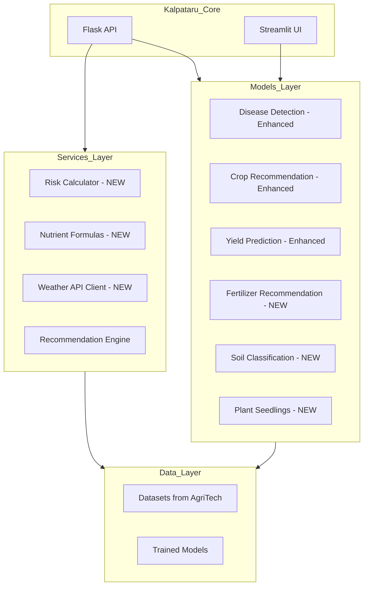

# AgriTech Integration Plan for Kalpataru

## Overview

This plan outlines the integration of features and models from the AgriTech folder into the Kalpataru Agricultural AI Platform. The integration will maintain the existing tech stack (Flask, Streamlit, TensorFlow, XGBoost, Prophet) and follow the current repository format.

---

## Current State Analysis

### Kalpataru Existing Features

| Feature | Model Type | File Location | Status |
|---------|------------|---------------|--------|
| Disease Detection | CNN (MobileNetV2) | `models/disease/` | Basic implementation |
| Crop Recommendation | Rule-based + ML | `models/crop/` | Basic implementation |
| Yield Prediction | XGBoost | `models/yield/` | Mock implementation |
| Price Forecasting | Prophet | `models/price/` | Mock implementation |
| Weather Forecasting | LSTM | `models/weather/` | Mock implementation |
| Irrigation | Rule-based | `models/irrigation/` | Basic implementation |

### AgriTech Features to Integrate

| Feature | Model Type | Source Location | Integration Priority |
|---------|------------|-----------------|---------------------|
| Disease Detection (Enhanced) | PyTorch CNN (38 classes) | `AgriTech/Disease prediction/` | High |
| Crop Yield Prediction | Random Forest | `AgriTech/Crop Yield Prediction/` | High |
| Crop Recommendation (Enhanced) | Random Forest + Label Encoder | `AgriTech/crop_recommendation/` | High |
| Fertilizer Recommendation | ML Classifier | `AgriTech/Fertiliser Recommendation System/` | High |
| Soil Classification | CNN | `AgriTech/Soil Classification Model/` | Medium |
| Plant Seedlings Classification | CNN | `AgriTech/Plant Seedlings Classification/` | Medium |
| Risk Calculator | Mathematical Formulas | `AgriTech/backend/utils/risk_calculators.py` | Medium |
| Nutrient Formulas | Scientific Calculations | `AgriTech/backend/utils/nutrient_formulas.py` | Medium |
| Weather API Client | API Integration | `AgriTech/backend/utils/weather_api_client.py` | Medium |

---

## Integration Architecture



---

## Detailed Implementation Plan

### Phase 1: New Model Integrations

#### 1.1 Fertilizer Recommendation Module (NEW)

**Files to Create:**
- `models/fertilizer/__init__.py`
- `models/fertilizer/fertilizer_model.py`
- `models/fertilizer/train_fertilizer.py`

**Files to Update:**
- `api/routes.py` - Add `/api/fertilizer/recommend` endpoint
- `api/schemas.py` - Add `FertilizerRecommendationRequest` schema
- `config/settings.py` - Add `FERTILIZER_MODEL_PATH`
- `config/constants.py` - Add fertilizer types and soil types
- `streamlit_app.py` - Add Fertilizer Recommendation page

**Source Reference:** `AgriTech/Fertiliser Recommendation System/`

**Implementation Details:**
```python
# Input parameters
- temperature: float
- humidity: float
- moisture: float
- soil_type: categorical (Sandy, Loamy, Black, Red, Clayey)
- crop_type: categorical (Wheat, Cotton, Maize, Paddy, Barley, Ground Nuts)
- nitrogen: int
- potassium: int
- phosphorous: int

# Output
- recommended_fertilizer: str
- application_instructions: str
```

---

#### 1.2 Soil Classification Module (NEW)

**Files to Create:**
- `models/soil/__init__.py`
- `models/soil/soil_classifier.py`
- `models/soil/train_soil_classifier.py`

**Files to Update:**
- `api/routes.py` - Add `/api/soil/classify` endpoint
- `api/schemas.py` - Add `SoilClassificationRequest` schema
- `config/settings.py` - Add `SOIL_MODEL_PATH`
- `config/constants.py` - Add soil classes
- `streamlit_app.py` - Add Soil Classification page

**Source Reference:** `AgriTech/Soil Classification Model/`

---

### Phase 2: Enhanced Existing Models

#### 2.1 Disease Detection Enhancement

**Current State:** 10 disease classes with mock predictions
**Target State:** 38 disease classes with trained PyTorch model

**Files to Update:**
- `models/disease/cnn_model.py` - Add PyTorch model support
- `models/disease/inference.py` - Update for 38 classes
- `config/constants.py` - Update `DISEASE_CLASSES` to 38 classes

**New Disease Classes from AgriTech:**
```python
DISEASE_CLASSES = [
    'Apple___Black_rot', 'Apple___healthy',
    'Corn___Cercospora_leaf_spot', 'Corn___Common_rust',
    'Corn___healthy', 'Grape___Black_rot', 'Grape___Esca',
    'Grape___healthy', 'Potato___Early_blight', 'Potato___Late_blight',
    'Potato___healthy', 'Tomato___Bacterial_spot', 'Tomato___Early_blight',
    'Tomato___Late_blight', 'Tomato___Leaf_Mold', 'Tomato___Septoria_leaf_spot',
    'Tomato___Spider_mites', 'Tomato___Target_Spot', 'Tomato___Yellow_Leaf_Curl_Virus',
    'Tomato___mosaic_virus', 'Tomato___healthy'
    # ... and more
]
```

**Source Reference:** `AgriTech/Disease prediction/model.py`, `AgriTech/Disease prediction/utils.py`

---

#### 2.2 Crop Yield Prediction Enhancement

**Current State:** Mock implementation with rule-based calculations
**Target State:** Trained Random Forest model with label encoders

**Files to Update:**
- `models/yield/yield_xgboost.py` - Replace with Random Forest implementation
- `scripts/train_crop_yield.py` - Update training script

**New Features:**
- Label encoders for area and crop types
- Support for multiple countries/regions
- Better accuracy with trained model

**Source Reference:** `AgriTech/Crop Yield Prediction/crop_yield_predictor.py`

---

#### 2.3 Crop Recommendation Enhancement

**Current State:** Rule-based scoring system
**Target State:** ML-based Random Forest with proper label encoding

**Files to Update:**
- `models/crop/crop_recommendation.py` - Add ML model support
- `scripts/train_crop_recommendation.py` - Update training script

**New Features:**
- PDF report generation
- Better input validation
- Proper ML model with label encoder

**Source Reference:** `AgriTech/crop_recommendation/app.py`

---

### Phase 3: New Services

#### 3.1 Risk Calculator Service

**Files to Create:**
- `services/risk_calculator.py`

**Features:**
- Agri-Risk Score (ARS) calculation
- Weather risk assessment
- Insurance premium calculation
- Crop success rate prediction

**Source Reference:** `AgriTech/backend/utils/risk_calculators.py`

---

#### 3.2 Nutrient Formulas Service

**Files to Create:**
- `services/nutrient_service.py`

**Features:**
- Nutrient gap calculation
- Fertilizer amount calculation
- Lime requirement estimation
- Crop-specific N-P-K targets

**Source Reference:** `AgriTech/backend/utils/nutrient_formulas.py`

---

#### 3.3 Weather API Client Service

**Files to Create:**
- `services/weather_client.py`

**Features:**
- OpenWeatherMap API integration
- Retry logic with exponential backoff
- Mock data for development

**Source Reference:** `AgriTech/backend/utils/weather_api_client.py`

---

### Phase 4: API and UI Updates

#### 4.1 New API Endpoints

| Endpoint | Method | Description |
|----------|--------|-------------|
| `/api/fertilizer/recommend` | POST | Fertilizer recommendation |
| `/api/soil/classify` | POST | Soil type classification |
| `/api/risk/calculate` | POST | Risk score calculation |
| `/api/nutrient/analyze` | POST | Soil nutrient analysis |

#### 4.2 Streamlit UI Updates

Add new pages for:
- Fertilizer Recommendation
- Soil Classification
- Risk Assessment Dashboard
- Enhanced visualization for all features

---

## File Structure After Integration

```
kalpataru/
├── models/
│   ├── disease/              # Enhanced (38 classes)
│   ├── irrigation/           # Existing
│   ├── weather/              # Existing
│   ├── yield/                # Enhanced (Random Forest)
│   ├── price/                # Existing
│   ├── crop/                 # Enhanced (ML-based)
│   ├── fertilizer/           # NEW
│   │   ├── __init__.py
│   │   ├── fertilizer_model.py
│   │   └── train_fertilizer.py
│   └── soil/                 # NEW
│       ├── __init__.py
│       ├── soil_classifier.py
│       └── train_soil_classifier.py
│
├── services/
│   ├── explainability.py     # Existing
│   ├── recommendation_engine.py  # Existing
│   ├── translation.py        # Existing
│   ├── risk_calculator.py    # NEW
│   ├── nutrient_service.py   # NEW
│   └── weather_client.py     # NEW
│
├── api/
│   ├── routes.py             # Updated with new endpoints
│   └── schemas.py            # Updated with new schemas
│
├── config/
│   ├── settings.py           # Updated with new paths
│   ├── constants.py          # Updated with new constants
│   └── training_config.py    # Existing
│
├── scripts/
│   ├── train_fertilizer.py   # NEW
│   ├── train_soil_classifier.py  # NEW
│   └── ... (existing scripts)
│
└── data/
    └── (datasets from AgriTech)
```

---

## Implementation Checklist

### Phase 1: New Models
- [ ] Create `models/fertilizer/` directory and files
- [ ] Create `models/soil/` directory and files
- [ ] Add fertilizer recommendation endpoint
- [ ] Add soil classification endpoint
- [ ] Update Streamlit UI with new pages

### Phase 2: Enhanced Models
- [ ] Update disease detection to support 38 classes
- [ ] Replace yield prediction with Random Forest model
- [ ] Enhance crop recommendation with ML model
- [ ] Update training scripts

### Phase 3: New Services
- [ ] Create risk calculator service
- [ ] Create nutrient formulas service
- [ ] Create weather API client service
- [ ] Integrate services with API

### Phase 4: Testing and Documentation
- [ ] Update API documentation
- [ ] Update README.md
- [ ] Add unit tests for new modules
- [ ] Integration testing

---

## Dependencies to Add

```txt
# Add to requirements.txt
torch>=2.0.0          # For PyTorch models
torchvision>=0.15.0   # For image models
reportlab>=4.0.0      # For PDF generation
```

---

## Notes

1. **Model Files**: Pre-trained model files (.pkl, .pth, .pt) should be placed in respective model directories but will be gitignored as per current configuration.

2. **Datasets**: The AgriTech folder contains datasets that should be moved to `data/raw/` or `Dataset/` following the existing data organization plan.

3. **Backward Compatibility**: All existing API endpoints will remain functional. New endpoints will be additive.

4. **Testing**: Each new module should have corresponding test files in a `tests/` directory.

---

## Next Steps

1. Review and approve this plan
2. Switch to Code mode for implementation
3. Implement Phase 1 (New Models)
4. Implement Phase 2 (Enhanced Models)
5. Implement Phase 3 (New Services)
6. Testing and documentation
