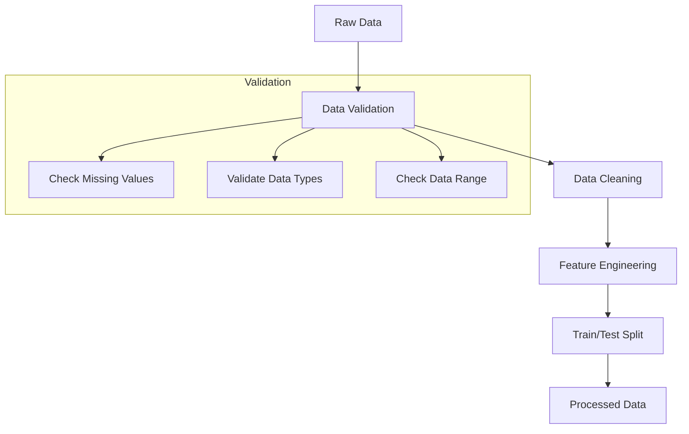
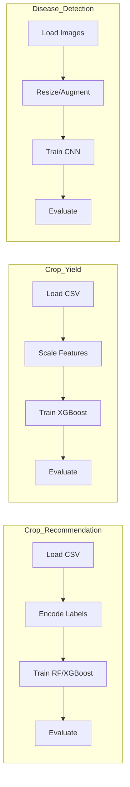

# Data Organization and Model Training Plan

## Overview

This plan outlines the strategy for organizing the available datasets and training machine learning models for the Kalpataru agricultural AI system.

---

## Available Datasets Summary

### 1. Crop Recommendation Dataset
- **Location**: `Dataset/crop recommendations/Crop_recommendation.csv`
- **Size**: ~150KB
- **Purpose**: Train crop recommendation model based on soil and climate parameters
- **Model**: Classification model (Random Forest/XGBoost)

### 2. Crop Yield Dataset
- **Location**: `Dataset/crop yield/crop_yield.csv`
- **Size**: ~1.6MB
- **Purpose**: Train yield prediction model
- **Model**: Regression model (XGBoost)

### 3. Plant Disease Detection Datasets
Multiple image datasets for CNN-based disease detection:

| Dataset | Description | Classes |
|---------|-------------|---------|
| `Plant_leave_diseases_dataset_with_augmentation` | Pre-augmented disease images | 39 classes |
| `Plant_leave_diseases_dataset_without_augmentation` | Original disease images | 39 classes |
| `PlantVillage-Dataset` | Original PlantVillage dataset | Multiple formats |
| `Database-Leaf-Images-practice-towards-Plant` | Practice leaf images | Various |
| `leaf color dataset` | Leaf color analysis | Various |

**Disease Classes Available**:
- Apple: Apple_scab, Black_rot, Cedar_apple_rust, healthy
- Corn: Cercospora_leaf_spot, Common_rust, healthy, Northern_Leaf_Blight
- Grape: Black_rot, Esca, healthy, Leaf_blight
- Potato: Early_blight, healthy, Late_blight
- Tomato: Bacterial_spot, Early_blight, healthy, Late_blight, Leaf_Mold, Septoria_leaf_spot, Spider_mites, Target_Spot, Tomato_mosaic_virus, Yellow_Leaf_Curl_Virus
- And more...

---

## Proposed Data Organization Structure

```
data/
├── raw/                          # Original, immutable data
│   ├── crop_recommendation/
│   │   └── Crop_recommendation.csv
│   ├── crop_yield/
│   │   └── crop_yield.csv
│   └── disease_images/
│       ├── Plant_leave_diseases_with_aug/
│       ├── Plant_leave_diseases_no_aug/
│       └── PlantVillage/
│
├── processed/                    # Cleaned and preprocessed data
│   ├── crop_recommendation/
│   │   ├── train.csv
│   │   ├── test.csv
│   │   └── label_encoders.pkl
│   ├── crop_yield/
│   │   ├── train.csv
│   │   ├── test.csv
│   │   └── feature_scalers.pkl
│   └── disease_images/
│       ├── train/
│       │   ├── Apple___Apple_scab/
│       │   ├── Apple___healthy/
│       │   └── ... (all classes)
│       ├── val/
│       │   └── ... (same structure)
│       └── test/
│           └── ... (same structure)
│
├── external/                     # External reference data
│   └── soil_data/
│       └── india_soil_types.json
│
└── analysis/                     # Analysis notebooks and results
    ├── crop_recommendation/
    │   ├── eda_crop_recommendation.ipynb
    │   └── feature_analysis.json
    ├── crop_yield/
    │   ├── eda_crop_yield.ipynb
    │   └── correlation_matrix.png
    └── disease_detection/
        ├── class_distribution.png
        └── sample_images.png
```

---

## Model Training Pipeline

### Phase 1: Data Preparation



### Phase 2: Model Training



---

## Implementation Steps

### Step 1: Organize Raw Data
- Move CSV files to `data/raw/crop_recommendation/` and `data/raw/crop_yield/`
- Move disease image datasets to `data/raw/disease_images/`
- Create metadata files documenting data sources

### Step 2: Create Preprocessing Scripts
1. **Crop Recommendation Preprocessor**
   - Handle missing values
   - Encode categorical variables (soil_type, season, region)
   - Normalize numerical features
   - Split into train/test sets (80/20)

2. **Crop Yield Preprocessor**
   - Handle missing values
   - Feature scaling
   - Create derived features
   - Split into train/test sets (80/20)

3. **Disease Image Preprocessor**
   - Resize images to 224x224
   - Split into train/val/test sets (70/15/15)
   - Apply augmentation (for non-augmented dataset)
   - Create class mappings

### Step 3: Create Training Scripts
1. **train_crop_recommendation.py**
   - Load preprocessed data
   - Train Random Forest classifier
   - Perform hyperparameter tuning
   - Save model and metrics

2. **train_crop_yield.py**
   - Load preprocessed data
   - Train XGBoost regressor
   - Perform hyperparameter tuning
   - Save model and metrics

3. **train_disease_detection.py**
   - Load image datasets
   - Build/train CNN model
   - Apply transfer learning (optional)
   - Save model weights

### Step 4: Update Configuration
- Update `config/settings.py` with new data paths
- Update `config/constants.py` with disease classes from dataset
- Create training configuration file

### Step 5: Create Evaluation Scripts
- Generate confusion matrices
- Calculate accuracy, precision, recall, F1
- Create performance reports

---

## Files to Create

| File | Purpose |
|------|---------|
| `scripts/organize_data.py` | Move and organize raw data |
| `scripts/preprocess_crop_recommendation.py` | Preprocess crop recommendation data |
| `scripts/preprocess_crop_yield.py` | Preprocess crop yield data |
| `scripts/preprocess_disease_images.py` | Preprocess disease images |
| `scripts/train_crop_recommendation.py` | Train crop recommendation model |
| `scripts/train_crop_yield.py` | Train crop yield model |
| `scripts/train_disease_detection.py` | Train disease detection CNN |
| `scripts/evaluate_model.py` | Evaluate trained models |
| `config/training_config.py` | Training hyperparameters |

---

## Expected Outputs

### Trained Models
- `models/crop/crop_recommendation_model.pkl`
- `models/yield/yield_xgboost_model.json`
- `models/disease/disease_cnn_weights.h5`

### Processed Data
- Train/test CSV files for tabular data
- Organized image folders for disease detection

### Analysis Results
- EDA notebooks with visualizations
- Model performance reports
- Feature importance charts

---

## Next Steps

1. **Approve this plan** - Confirm the data organization structure
2. **Switch to Code mode** - Implement the data organization scripts
3. **Run preprocessing** - Process all datasets
4. **Train models** - Execute training scripts
5. **Evaluate results** - Analyze model performance

---

## Notes

- The disease detection dataset has 39 classes, but the current model expects 10. We need to update the model or filter the dataset.
- Consider using transfer learning (ResNet, EfficientNet) for better disease detection accuracy.
- The crop recommendation and yield datasets appear ready for training with minimal preprocessing.
