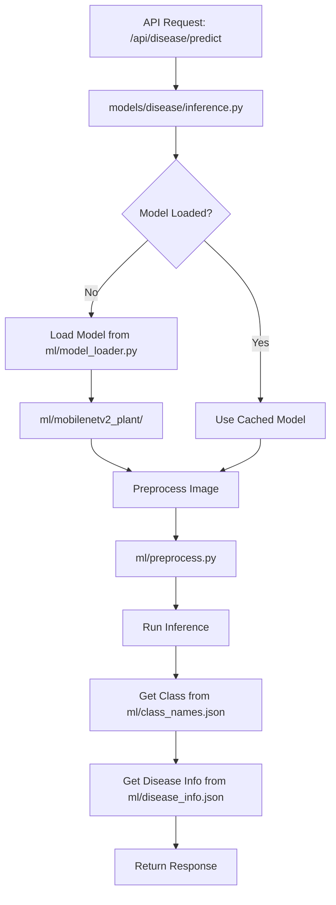

# Plant Disease Model Integration Plan

## Overview

This plan outlines the integration of the new MobileNetV2 plant disease detection model from the `ml/` directory into the existing Kalpataru backend.

## Current State Analysis

### New ML Module (`ml/`)
The user has added a working plant disease detection module:

| File | Purpose |
|------|---------|
| [`ml/model_loader.py`](ml/model_loader.py) | MobileNetV2 model loader with 38-class classifier |
| [`ml/preprocess.py`](ml/preprocess.py) | Image preprocessing utilities for PyTorch |
| [`ml/class_names.json`](ml/class_names.json) | 38 disease class names |
| [`ml/disease_info.json`](ml/disease_info.json) | Rich disease metadata with symptoms, treatment, prevention |
| [`ml/mobilenetv2_plant/`](ml/mobilenetv2_plant/) | TorchScript model directory with data.pkl |

### Existing Disease Module (`models/disease/`)
| File | Purpose |
|------|---------|
| [`models/disease/inference.py`](models/disease/inference.py) | Main inference module - currently using mock predictions |
| [`models/disease/cnn_model.py`](models/disease/cnn_model.py) | Contains DISEASE_CLASSES_38 and DISEASE_INFO dictionaries |

### Key Observations

1. **Model Loading**: The new `ml/model_loader.py` has robust model loading that handles:
   - TorchScript models from directories
   - State dict files (.pth)
   - Fallback to pretrained MobileNetV2

2. **Class Names Mismatch**: There are slight differences in class naming:
   - `ml/class_names.json`: `Tomato___Spider_mites_(Two-spotted_spider_mite)`
   - `models/disease/cnn_model.py`: `Tomato___Spider_mites Two-spotted_spider_mite`

3. **Disease Info**: The new `ml/disease_info.json` has richer information including:
   - `severity` field
   - `symptoms` field
   - More detailed descriptions

## Integration Architecture



## Implementation Steps

### Step 1: Update Configuration
**File**: [`config/settings.py`](config/settings.py)

Add new path for the ML model:
```python
# New ML module path
ML_MODEL_DIR = BASE_DIR / 'ml'
ML_DISEASE_MODEL_PATH = ML_MODEL_DIR / 'mobilenetv2_plant'
ML_CLASS_NAMES_PATH = ML_MODEL_DIR / 'class_names.json'
ML_DISEASE_INFO_PATH = ML_MODEL_DIR / 'disease_info.json'
```

### Step 2: Modify Inference Module
**File**: [`models/disease/inference.py`](models/disease/inference.py)

Changes needed:
1. Import the new model loader and preprocessing from `ml/` module
2. Load class names from `ml/class_names.json`
3. Load disease info from `ml/disease_info.json`
4. Update `get_model()` to use `ml.model_loader.get_model()`
5. Update `_predict_pytorch()` to use `ml.preprocess.preprocess_image()`

### Step 3: Update Class Names
**File**: [`models/disease/cnn_model.py`](models/disease/cnn_model.py)

Options:
- **Option A**: Replace `DISEASE_CLASSES_38` with classes from `ml/class_names.json`
- **Option B**: Load classes dynamically from JSON file (recommended)

### Step 4: Integrate Disease Info
**File**: [`models/disease/cnn_model.py`](models/disease/cnn_model.py)

Merge the richer disease information from `ml/disease_info.json`:
- Add `severity` field
- Add `symptoms` field
- Update `get_disease_info()` to load from JSON

### Step 5: Update API Response
**File**: [`models/disease/inference.py`](models/disease/inference.py)

Enhance the response to include new fields:
```python
{
    'disease': 'Tomato___Early_blight',
    'confidence': 0.95,
    'is_healthy': False,
    'severity': 'High',  # New field
    'symptoms': '...',    # New field
    'description': '...',
    'treatment': '...',
    'prevention': '...',
    'recommendations': [...],
    'top_predictions': [...],
    'model_type': 'pytorch'
}
```

## Files to Modify

| File | Changes |
|------|---------|
| `config/settings.py` | Add ML module paths |
| `models/disease/inference.py` | Integrate ml/model_loader.py and ml/preprocess.py |
| `models/disease/cnn_model.py` | Update class names and disease info loading |

## Testing Plan

1. **Unit Test**: Test model loading from `ml/mobilenetv2_plant/`
2. **Unit Test**: Test preprocessing with sample images
3. **Integration Test**: Test `/api/disease/predict` endpoint
4. **Verify**: Check server logs for successful model loading

## Risk Assessment

| Risk | Mitigation |
|------|------------|
| Model file format incompatibility | The model_loader.py already handles multiple formats |
| Class name mismatch | Use class names from ml/class_names.json consistently |
| Missing dependencies | Ensure torch and torchvision are in requirements.txt |

## Expected Outcome

After integration:
- The disease detection API will use the trained MobileNetV2 model
- Predictions will be accurate instead of mock/color-based
- Response will include richer disease information
- Model will load automatically on server startup
