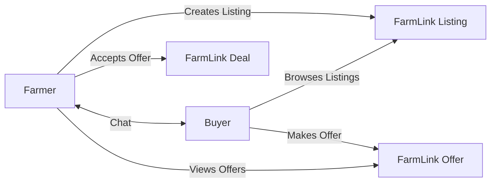

# FarmLink Implementation Plan

## Overview
Add FarmLink as a new marketplace module connecting farmers directly to buyers. This includes:
- **Backend**: API endpoints, database models, and service layer
- **Frontend**: Dedicated FarmLink page with full marketplace functionality

---

## Current State Analysis

### Existing Infrastructure (Reuse These)
| Component | Location | Purpose |
|-----------|----------|---------|
| Pools API | `AgriTech/backend/api/v1/pools.py` | Farmer collective selling |
| Procurement API | `AgriTech/backend/api/v1/procurement.py` | Buyer order management |
| Mandi API | `AgriTech/backend/api/v1/mandi.py` | Market price data |
| Agrochemicals API | `AgriTech/backend/api/v1/agrochemicals.py` | Buyer-seller marketplace |
| User Model | `AgriTech/backend/models/user.py` | Authentication |

### What's Missing
- FarmLink-specific API endpoints (`/api/v1/farmlink`)
- FarmLink database models
- FarmLink service layer
- FarmLink frontend page

---

## Implementation Todo List

### Phase 1: Database Models
- [ ] Create `AgriTech/backend/models/farmlink.py` with:
  - `FarmLinkListing` - farmer product listings
  - `FarmLinkOffer` - buyer offers
  - `FarmLinkDeal` - completed transactions
  - `FarmLinkConversation` - buyer-farmer chat

### Phase 2: Service Layer
- [ ] Create `AgriTech/backend/services/farmlink_service.py` with:
  - `create_listing()` - farmer posts produce
  - `list_listings()` - browse available produce
  - `create_offer()` - buyer makes offer
  - `accept_offer()` - farmer accepts deal
  - `get_conversations()` - messaging

### Phase 3: API Blueprint
- [ ] Create `AgriTech/backend/api/v1/farmlink.py` with REST endpoints:
  - `POST /api/v1/farmlink/listings` - Create listing
  - `GET /api/v1/farmlink/listings` - List listings (with filters)
  - `GET /api/v1/farmlink/listings/<id>` - Get listing details
  - `POST /api/v1/farmlink/offers` - Make offer
  - `POST /api/v1/farmlink/offers/<id>/accept` - Accept offer
  - `GET /api/v1/farmlink/deals` - View deals
  - `POST /api/v1/farmlink/messages` - Send message

- [ ] Register blueprint in `AgriTech/backend/api/v1/__init__.py`

### Phase 4: Frontend Page
- [ ] Create `AgriTech/farmlink.html` with:
  - Hero section with FarmLink branding
  - Browse listings grid (filterable by crop, location, price)
  - Create listing form for farmers
  - Listing detail modal with offer capability
  - My Listings / My Offers / My Deals dashboard
  - Messaging system for buyer-farmer communication

### Phase 5: Integration
- [ ] Add FarmLink navigation link to navbar
- [ ] Update "Explore FarmLink" button in index.html to link to farmlink.html
- [ ] Connect frontend to backend API

---

## API Endpoints Detail

```
POST   /api/v1/farmlink/listings              # Create new listing
GET    /api/v1/farmlink/listings              # List all (with ?crop=&location=&min_price=&max_price=)
GET    /api/v1/farmlink/listings/<id>        # Get listing details
PUT    /api/v1/farmlink/listings/<id>        # Update listing
DELETE /api/v1/farmlink/listings/<id>        # Delete listing

POST   /api/v1/farmlink/listings/<id>/offers     # Create offer
GET    /api/v1/farmlink/listings/<id>/offers     # Get offers for listing
POST   /api/v1/farmlink/offers/<id>/accept       # Accept offer
POST   /api/v1/farmlink/offers/<id>/reject       # Reject offer

GET    /api/v1/farmlink/deals                 # My deals (as farmer or buyer)
GET    /api/v1/farmlink/deals/<id>            # Deal details

POST   /api/v1/farmlink/messages              # Send message
GET    /api/v1/farmlink/conversations         # List conversations
GET    /api/v1/farmlink/conversations/<id>/messages  # Get messages
```

---

## Data Models

### FarmLinkListing
```python
{
    "id": int,
    "farmer_id": int,
    "crop_name": str,
    "quantity_tons": float,
    "price_per_ton": float,
    "location": str,
    "state": str,
    "description": str,
    "image_url": str,
    "status": "ACTIVE" | "SOLD" | "EXPIRED",
    "created_at": datetime
}
```

### FarmLinkOffer
```python
{
    "id": int,
    "listing_id": int,
    "buyer_id": int,
    "offered_price": float,
    "message": str,
    "status": "PENDING" | "ACCEPTED" | "REJECTED",
    "created_at": datetime
}
```

---

## Frontend Features

### For Farmers
- Post produce with photos, quantity, expected price
- View offers from buyers
- Accept/reject offers
- Chat with buyers
- Track completed deals

### For Buyers
- Browse available produce by crop/location/price
- Make offers on listings
- Chat with farmers
- Track purchase deals

---

## Mermaid: FarmLink Flow


