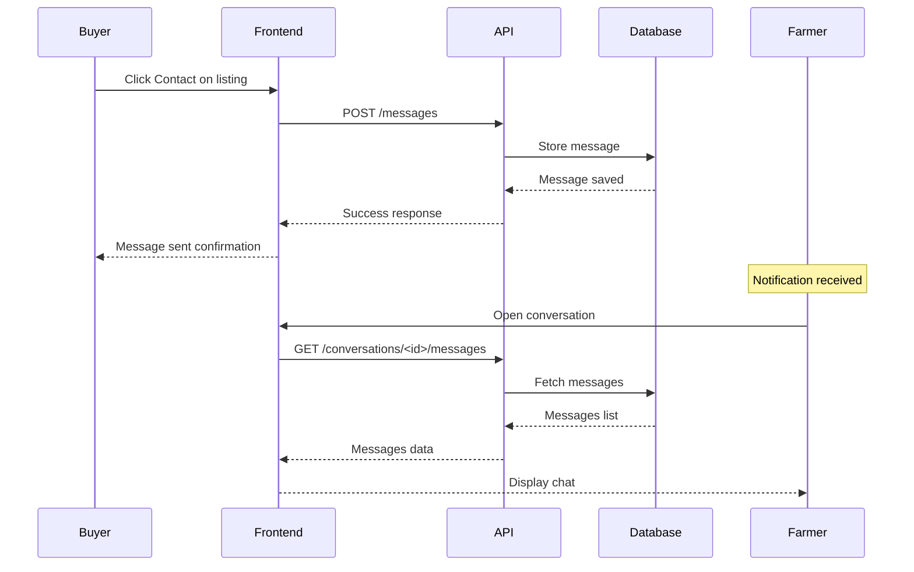

# FarmLink Messaging Feature Plan

## Overview
Add a complete messaging system to FarmLink that allows farmers and buyers to communicate directly about listings and deals.

---

## Current State

### Already Implemented (AgriTech Backend)
| Component | Location | Status |
|-----------|----------|--------|
| FarmLinkMessage Model | `AgriTech/backend/models/farmlink.py:128-158` | ✅ Complete |
| send_message service | `AgriTech/backend/services/farmlink_service.py:354-376` | ✅ Complete |
| get_conversations service | `AgriTech/backend/services/farmlink_service.py:378-402` | ✅ Complete |
| get_messages service | `AgriTech/backend/services/farmlink_service.py:404-419` | ✅ Complete |
| POST /messages endpoint | `AgriTech/backend/api/v1/farmlink.py:322-349` | ✅ Complete |
| GET /conversations endpoint | `AgriTech/backend/api/v1/farmlink.py:352-367` | ✅ Complete |
| GET /conversations/<id>/messages | `AgriTech/backend/api/v1/farmlink.py:370-385` | ✅ Complete |

### Missing Components
| Component | Location | Status |
|-----------|----------|--------|
| Demo API messaging endpoints | `api/routes.py` | ❌ Missing |
| Messaging UI in frontend | `frontend/farmlink.html` | ❌ Missing |
| Messaging UI in AgriTech | `AgriTech/farmlink.html` | ❌ Missing |

---

## Implementation Plan

### Phase 1: Demo API Messaging Endpoints
Add in-memory messaging endpoints to `api/routes.py`:

```python
# In-memory storage for messages
farmlink_messages = []

# Endpoints to add:
POST /api/farmlink/messages              # Send a message
GET  /api/farmlink/conversations         # List user conversations
GET  /api/farmlink/conversations/<id>/messages  # Get conversation messages
```

### Phase 2: Frontend Messaging UI
Add messaging components to `frontend/farmlink.html`:

1. **Conversations Tab** - New tab in the navigation
2. **Conversation List** - Shows all conversations with preview
3. **Chat Window** - Message display and input
4. **Contact Button** - On listing cards to start conversation

### Phase 3: AgriTech Frontend
Mirror the messaging UI in `AgriTech/farmlink.html`

---

## UI Design

### Conversation List Component
```
┌─────────────────────────────────────────┐
│ 💬 Messages                             │
├─────────────────────────────────────────┤
│ ┌─────────────────────────────────────┐ │
│ │ 🌾 Rice - Maharashtra               │ │
│ │ Last: Sure, I can deliver by...     │ │
│ │ 2 hours ago                         │ │
│ └─────────────────────────────────────┘ │
│ ┌─────────────────────────────────────┐ │
│ │ 🍅 Tomatoes - Karnataka             │ │
│ │ Last: What is the minimum order?    │ │
│ │ Yesterday                           │ │
│ └─────────────────────────────────────┘ │
└─────────────────────────────────────────┘
```

### Chat Window Component
```
┌─────────────────────────────────────────┐
│ ← Back    Chat about: Basmati Rice      │
├─────────────────────────────────────────┤
│                                         │
│ [Farmer] Hello! I have 50 tons         │
│          available.                     │
│                    10:30 AM             │
│                                         │
│          [You] What's your best price?  │
│                    10:32 AM             │
│                                         │
│ [Farmer] ₹45,000/ton, can negotiate     │
│                    10:35 AM             │
│                                         │
├─────────────────────────────────────────┤
│ [Type a message...        ] [Send]      │
└─────────────────────────────────────────┘
```

---

## API Endpoints Detail

### POST /api/farmlink/messages
Request:
```json
{
    "listing_id": 1,
    "receiver_id": 2,
    "message": "Hello! I'm interested in your produce."
}
```

Response:
```json
{
    "success": true,
    "message": {
        "id": 1,
        "conversation_id": "1-1-2",
        "listing_id": 1,
        "sender_id": 1,
        "receiver_id": 2,
        "message": "Hello! I'm interested in your produce.",
        "created_at": "2024-01-15T10:30:00Z"
    }
}
```

### GET /api/farmlink/conversations
Response:
```json
{
    "success": true,
    "conversations": [
        {
            "conversation_id": "1-1-2",
            "listing_id": 1,
            "listing_title": "Basmati Rice",
            "other_user_id": 2,
            "other_user_name": "Farmer John",
            "last_message": "Can you deliver by Friday?",
            "last_message_at": "2024-01-15T10:30:00Z",
            "unread_count": 2
        }
    ]
}
```

### GET /api/farmlink/conversations/<conversation_id>/messages
Response:
```json
{
    "success": true,
    "messages": [
        {
            "id": 1,
            "sender_id": 1,
            "sender_name": "Buyer",
            "message": "Hello!",
            "is_mine": true,
            "created_at": "2024-01-15T10:00:00Z"
        },
        {
            "id": 2,
            "sender_id": 2,
            "sender_name": "Farmer John",
            "message": "Hi! How can I help?",
            "is_mine": false,
            "created_at": "2024-01-15T10:05:00Z"
        }
    ]
}
```

---

## Mermaid: Messaging Flow



---

## Implementation Checklist

### Backend (api/routes.py)
- [ ] Add `farmlink_messages` in-memory storage
- [ ] Add `POST /api/farmlink/messages` endpoint
- [ ] Add `GET /api/farmlink/conversations` endpoint
- [ ] Add `GET /api/farmlink/conversations/<id>/messages` endpoint

### Frontend (frontend/farmlink.html)
- [ ] Add Messages tab to navigation
- [ ] Create conversation list component
- [ ] Create chat window modal
- [ ] Add Contact button to listing cards
- [ ] Implement message sending
- [ ] Implement real-time message refresh

### AgriTech Frontend (AgriTech/farmlink.html)
- [ ] Mirror all frontend changes

---

## Files to Modify

1. `api/routes.py` - Add messaging endpoints
2. `frontend/farmlink.html` - Add messaging UI
3. `AgriTech/farmlink.html` - Add messaging UI
