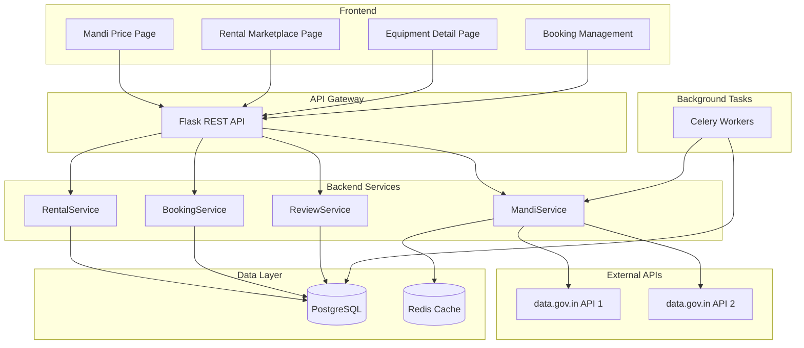

# Mandi Price API & Enhanced Renting Module Implementation Plan

## Overview

This plan outlines the implementation of two major modules for the Kalpataru AgriTech platform:

1. **Mandi Price API Module** - Integration with Government of India's data.gov.in APIs for real-time commodity prices
2. **Enhanced Renting Module** - Expansion of existing rental system to include Tractors, Drones, Seeds, and agricultural equipment

---

## Module 1: Mandi Price API Integration

### 1.1 API Endpoints to Integrate

The Government of India provides two key APIs:

#### API 1: Current Daily Price of Various Commodities
- **Endpoint**: `https://api.data.gov.in/resource/9ef84268-d588-465a-a308-a864a43d0070`
- **Purpose**: Get current daily prices from various markets
- **Filters Available**:
  - `filters[state.keyword]` - State filter
  - `filters[district]` - District filter
  - `filters[market]` - Market filter
  - `filters[commodity]` - Commodity filter
  - `filters[variety]` - Variety filter
  - `filters[grade]` - Grade filter

#### API 2: Variety-wise Daily Market Prices
- **Endpoint**: `https://api.data.gov.in/resource/35985678-0d79-46b4-9ed6-6f13308a1d24`
- **Purpose**: Get variety-wise daily market prices
- **Filters Available**:
  - `filters[State]` - State filter
  - `filters[District]` - District filter
  - `filters[Commodity]` - Commodity filter
  - `filters[Arrival_Date]` - Arrival Date filter

### 1.2 Backend Architecture

```
backend/
├── services/
│   └── mandi_service.py          # API client for data.gov.in
├── models/
│   └── mandi_price.py            # Cached price data models
├── api/v1/
│   └── mandi.py                  # REST API endpoints
├── schemas/
│   └── mandi_schema.py           # Request/Response schemas
└── tasks/
    └── mandi_tasks.py            # Celery tasks for scheduled sync
```

### 1.3 Data Models

```python
# MandiPrice Model
class MandiPrice:
    id: int
    state: str
    district: str
    market: str
    commodity: str
    variety: str
    grade: str
    arrival_date: date
    min_price: float
    max_price: float
    modal_price: float      # Most common price
    commodity_code: str
    created_at: datetime
    updated_at: datetime

# MandiSyncLog Model
class MandiSyncLog:
    id: int
    sync_type: str          # 'daily' or 'variety'
    records_fetched: int
    sync_status: str
    error_message: str
    started_at: datetime
    completed_at: datetime
```

### 1.4 API Endpoints Design

| Method | Endpoint | Description |
|--------|----------|-------------|
| GET | `/api/v1/mandi/prices` | Get current prices with filters |
| GET | `/api/v1/mandi/prices/<commodity>` | Get prices for specific commodity |
| GET | `/api/v1/mandi/variety-prices` | Get variety-wise prices |
| GET | `/api/v1/mandi/states` | List available states |
| GET | `/api/v1/mandi/districts` | List districts by state |
| GET | `/api/v1/mandi/markets` | List markets by district |
| GET | `/api/v1/mandi/commodities` | List all available commodities |
| POST | `/api/v1/mandi/sync` | Trigger manual sync (admin) |
| GET | `/api/v1/mandi/trends/<commodity>` | Price trends analysis |

### 1.5 Service Layer

```python
# mandi_service.py
class MandiService:
    BASE_URL = "https://api.data.gov.in/resource/"
    API_KEY = os.getenv('MANDI_API_KEY')
    
    @staticmethod
    def get_daily_prices(state=None, district=None, market=None, 
                         commodity=None, variety=None, grade=None,
                         offset=0, limit=50):
        """Fetch current daily prices from API 1"""
        
    @staticmethod
    def get_variety_prices(state=None, district=None, 
                           commodity=None, arrival_date=None):
        """Fetch variety-wise prices from API 2"""
        
    @staticmethod
    def get_price_trends(commodity, district, days=30):
        """Analyze price trends over time"""
        
    @staticmethod
    def sync_prices():
        """Scheduled task to sync and cache prices"""
```

### 1.6 Caching Strategy

- Use Redis cache for frequently accessed price data
- Cache TTL: 6 hours for current prices
- Background sync every 4 hours via Celery
- Fallback to cached data if API is unavailable

---

## Module 2: Enhanced Renting Module

### 2.1 Current State Analysis

The existing rental system includes:
- [`Equipment`](AgriTech/backend/models/equipment.py:5) model with basic fields
- [`RentalBooking`](AgriTech/backend/models/equipment.py:57) model with status workflow
- [`RentalService`](AgriTech/backend/services/rental_service.py:8) with booking logic
- [`equipment_bp`](AgriTech/backend/api/v1/equipment.py:6) blueprint

### 2.2 Enhanced Categories

```
Rental Categories:
├── Machinery
│   ├── Tractors (various HP ranges)
│   ├── Harvesters
│   ├── Threshers
│   ├── Tillers
│   └── Sprayers
├── Technology
│   ├── Drones (spraying, mapping, monitoring)
│   ├── Sensors (soil, weather)
│   └── GPS Equipment
├── Seeds & Planting
│   ├── Seeds (certified, hybrid)
│   ├── Seedlings
│   └── Saplings
├── Irrigation
│   ├── Pumps
│   ├── Pipes
│   └── Sprinklers
└── Tools
    ├── Hand Tools
    ├── Power Tools
    └── Safety Equipment
```

### 2.3 Enhanced Data Models

```python
# Enhanced Equipment Model
class Equipment:
    # Existing fields...
    category: str              # Enhanced categories
    sub_category: str          # Sub-category within main category
    brand: str                 # Brand name
    model_number: str          # Model/variant
    year_of_manufacture: int   # For machinery
    condition: str             # NEW, EXCELLENT, GOOD, FAIR
    quantity_available: int    # For seeds/consumables
    
    # Rental-specific
    rental_type: str           # HOURLY, DAILY, WEEKLY, MONTHLY
    security_deposit: float
    minimum_rental_period: int
    maximum_rental_period: int
    
    # Location & Delivery
    pickup_location: str
    delivery_available: bool
    delivery_radius_km: int
    delivery_charges: float
    
    # Verification
    is_verified: bool          # Admin verified listing
    verification_date: datetime
    documents_url: str         # Ownership/quality documents
    
    # For Seeds specifically
    seed_variety: str
    germination_rate: float
    certification_number: str
    expiry_date: date

# New: Equipment Review Model
class EquipmentReview:
    id: int
    equipment_id: int
    reviewer_id: int
    booking_id: int
    rating: int                # 1-5 stars
    review_text: str
    performance_rating: int
    condition_rating: int
    value_rating: int
    created_at: datetime

# New: Equipment Availability Exception
class EquipmentAvailabilityException:
    id: int
    equipment_id: int
    exception_type: str        # MAINTENANCE, PERSONAL, HOLIDAY
    start_date: date
    end_date: date
    notes: str
```

### 2.4 API Endpoints Design

| Method | Endpoint | Description |
|--------|----------|-------------|
| GET | `/api/v1/rentals/categories` | List all rental categories |
| GET | `/api/v1/rentals/equipment` | Search equipment with filters |
| GET | `/api/v1/rentals/equipment/<id>` | Get equipment details |
| POST | `/api/v1/rentals/equipment` | List equipment for rent |
| PUT | `/api/v1/rentals/equipment/<id>` | Update equipment listing |
| DELETE | `/api/v1/rentals/equipment/<id>` | Remove equipment listing |
| GET | `/api/v1/rentals/equipment/<id>/availability` | Check availability calendar |
| POST | `/api/v1/rentals/bookings` | Create rental booking |
| GET | `/api/v1/rentals/bookings` | Get user's bookings |
| PUT | `/api/v1/rentals/bookings/<id>/status` | Update booking status |
| POST | `/api/v1/rentals/bookings/<id>/review` | Submit review after rental |
| GET | `/api/v1/rentals/equipment/<id>/reviews` | Get equipment reviews |
| GET | `/api/v1/rentals/my-equipment` | Get owner's equipment list |
| GET | `/api/v1/rentals/dashboard` | Owner dashboard stats |

### 2.5 Category-Specific Features

#### Tractors
- HP range filter (under 30HP, 30-50HP, 50-75HP, above 75HP)
- 2WD/4WD specification
- Implement compatibility list
- Operator availability option
- Fuel type (Diesel/Petrol)

#### Drones
- Type: Spraying, Mapping, Monitoring
- Coverage capacity per charge
- Payload capacity
- Operator required (yes/no)
- Flight time per battery
- Certification requirements

#### Seeds
- Crop type and variety
- Quantity available (kg)
- Germination rate
- Certification details
- Expiry date
- Bulk pricing options
- Minimum order quantity

---

## Architecture Diagram



---

## Implementation Phases

### Phase 1: Mandi Price API
1. Create MandiService with API integration
2. Implement data models and caching
3. Build REST API endpoints
4. Create frontend price display page
5. Add price alert functionality

### Phase 2: Enhanced Rental Categories
1. Extend Equipment model with new fields
2. Create category-specific schemas
3. Update RentalService for new categories
4. Build category-specific frontend views
5. Implement review system

### Phase 3: Advanced Features
1. Price trend analysis and charts
2. Equipment recommendation engine
3. Delivery tracking integration
4. Payment gateway integration
5. Mobile-responsive design

---

## Configuration Requirements

### Environment Variables
```env
# Mandi API Configuration
MANDI_API_KEY=579b464db66ec23bdd0000018263afcca3cf4ce05558a68fceb1f2ec
MANDI_API_BASE_URL=https://api.data.gov.in/resource/
MANDI_CACHE_TTL=21600  # 6 hours in seconds

# Rental Configuration
MAX_RENTAL_DAYS=90
DEFAULT_SECURITY_DEPOSIT_PERCENT=20
RENTAL_CANCELLATION_HOURS=24
```

---

## Testing Strategy

### Unit Tests
- MandiService API calls with mocked responses
- RentalService booking logic
- Price calculation algorithms
- Availability conflict detection

### Integration Tests
- End-to-end booking flow
- API response validation
- Cache invalidation
- External API error handling

### Performance Tests
- Concurrent booking requests
- Large dataset pagination
- Cache hit/miss ratios

---

## Security Considerations

1. **API Key Protection**: Store Mandi API key in environment variables
2. **Rate Limiting**: Implement rate limiting on all rental endpoints
3. **Input Validation**: Sanitize all filter parameters
4. **Authorization**: Verify ownership for equipment updates
5. **Payment Security**: Use escrow for rental payments

---

## Files to Create/Modify

### New Files
- `AgriTech/backend/services/mandi_service.py`
- `AgriTech/backend/models/mandi_price.py`
- `AgriTech/backend/api/v1/mandi.py`
- `AgriTech/backend/schemas/mandi_schema.py`
- `AgriTech/backend/tasks/mandi_tasks.py`
- `AgriTech/backend/models/equipment_review.py`
- `AgriTech/backend/services/equipment_review_service.py`
- `AgriTech/mandi_prices.html`
- `AgriTech/rental_marketplace.html`
- `AgriTech/mandi.css`
- `AgriTech/rental.css`
- `AgriTech/mandi.js`
- `AgriTech/rental.js`

### Files to Modify
- `AgriTech/backend/api/v1/__init__.py` - Register new blueprints
- `AgriTech/backend/models/equipment.py` - Add new fields
- `AgriTech/backend/services/rental_service.py` - Enhance with new features
- `AgriTech/backend/models/__init__.py` - Import new models
- `AgriTech/app.py` - Register new routes
- `AgriTech/navbar.html` - Add navigation links

---

## Success Metrics

1. **Mandi Price Module**
   - API response time < 2 seconds
   - Cache hit rate > 80%
   - Price data freshness < 6 hours
   - All states and commodities covered

2. **Rental Module**
   - Booking conversion rate > 15%
   - Average equipment utilization > 40%
   - User satisfaction rating > 4.0/5.0
   - Response time for availability check < 500ms
