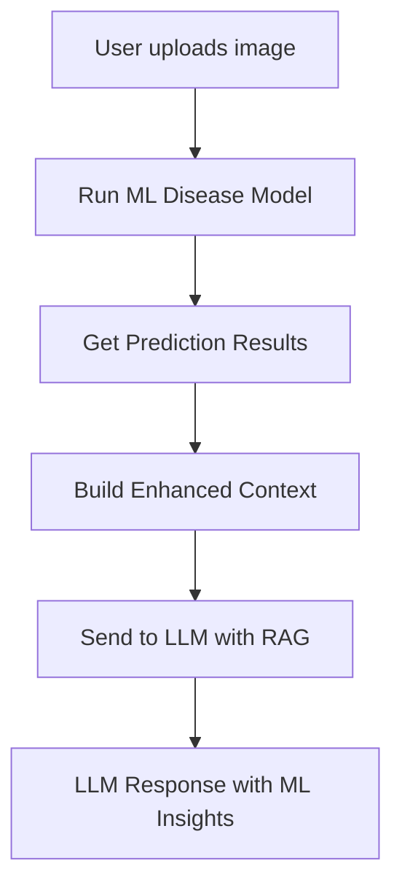

# RAG Integration Plan for Plant Disease Model

## Overview

This plan outlines how to integrate the MobileNetV2 plant disease detection model with the AI assistant's RAG (Retrieval-Augmented Generation) system.

## Current Architecture

The AI assistant ([`services/ai_assistant.py`](services/ai_assistant.py)) has:

1. **AgriculturalKnowledgeBase** - A simple RAG-like system with hardcoded knowledge chunks
2. **AIAssistant** - Uses OpenRouter API for chat with image understanding
3. **analyze_image()** - Analyzes images for agricultural insights

## Integration Strategy

### Option 1: Enhance Image Analysis with ML Model Results

When a user uploads an image for disease analysis:

1. First run the image through the MobileNetV2 disease model
2. Get prediction results (disease name, confidence, severity, treatment)
3. Include this as context in the RAG prompt to the LLM
4. LLM can then provide enhanced, accurate advice based on ML predictions



### Option 2: Add Disease Predictions to Knowledge Base

Add the 38 disease classes and their information to the knowledge base:

```python
{
    "topic": "disease_detection_ml",
    "content": """
    Plant Disease Detection Model Results:
    - Disease: {predicted_disease}
    - Confidence: {confidence}%
    - Severity: {severity}
    - Symptoms: {symptoms}
    - Treatment: {treatment}
    - Prevention: {prevention}
    """
}
```

## Implementation Steps

### Step 1: Create Disease Context Builder

Add a method to build RAG context from ML predictions:

```python
def build_disease_context(self, prediction_result: Dict) -> str:
    """Build RAG context from disease prediction results."""
    return f"""
    ML Model Disease Detection Results:
    - Predicted Disease: {prediction_result['disease']}
    - Confidence: {prediction_result['confidence'] * 100:.1f}%
    - Is Healthy: {prediction_result['is_healthy']}
    - Severity: {prediction_result.get('severity', 'Unknown')}
    
    Disease Information:
    - Symptoms: {prediction_result.get('symptoms', 'N/A')}
    - Treatment: {prediction_result.get('treatment', 'N/A')}
    - Prevention: {prediction_result.get('prevention', 'N/A')}
    
    Top Predictions:
    {self._format_top_predictions(prediction_result.get('top_predictions', []))}
    """
```

### Step 2: Enhance analyze_image Method

Modify the `analyze_image` method to use ML model first:

```python
def analyze_image(self, image_data, analysis_type="general"):
    # If disease analysis, run ML model first
    if analysis_type == "disease" or analysis_type == "general":
        ml_result = self._run_disease_model(image_data)
        if ml_result:
            # Add ML results to context
            disease_context = self.build_disease_context(ml_result)
            # Enhance prompt with ML results
            prompt = f"""
            Based on ML model analysis of the plant image:
            {disease_context}
            
            Please provide detailed advice and recommendations.
            """
    
    # Continue with LLM call...
```

### Step 3: Add Disease Knowledge to Knowledge Base

Load disease information from `ml/disease_info.json`:

```python
def _load_knowledge(self):
    knowledge_chunks = [...existing chunks...]
    
    # Add disease-specific knowledge from ML module
    disease_info = self._load_disease_info()
    for disease_name, info in disease_info.items():
        knowledge_chunks.append({
            "topic": f"disease_{disease_name}",
            "content": f"""
            Disease: {info['disease']}
            Plant: {info['plant']}
            Severity: {info['severity']}
            Description: {info['description']}
            Symptoms: {info['symptoms']}
            Treatment: {info['treatment']}
            Prevention: {info['prevention']}
            """
        })
    
    return knowledge_chunks
```

## Files to Modify

| File | Changes |
|------|---------|
| `services/ai_assistant.py` | Add ML model integration to image analysis |
| `services/ai_assistant.py` | Load disease info into knowledge base |

## Expected Benefits

1. **More Accurate Responses**: LLM gets precise disease predictions from ML model
2. **Contextual Advice**: LLM can provide treatment recommendations based on ML results
3. **Confidence Indicators**: Users know how confident the model is
4. **Fallback Support**: If ML model fails, LLM can still provide general advice

## Example Enhanced Response

**User uploads tomato leaf image**

**ML Model Result:**
- Disease: Tomato___Early_blight
- Confidence: 92%
- Severity: Medium

**LLM Response (with RAG context):**
> Based on the AI analysis of your tomato plant image, I've identified **Early Blight** with 92% confidence. This is a fungal disease caused by Alternaria solani.
>
> **Symptoms to look for:**
> - Target-like concentric rings on lower leaves
> - Yellowing and browning of affected leaves
>
> **Recommended Treatment:**
> 1. Remove and destroy infected lower leaves
> 2. Apply chlorothalonil or mancozeb fungicide
> 3. Mulch around plants to prevent spore splash
> 4. Ensure good air circulation between plants
>
> **Prevention for next season:**
> - Rotate crops (avoid planting tomatoes in the same spot)
> - Use disease-resistant varieties
> - Maintain proper plant spacing
>
> Would you like more specific guidance on fungicide application or resistant varieties for your region?
